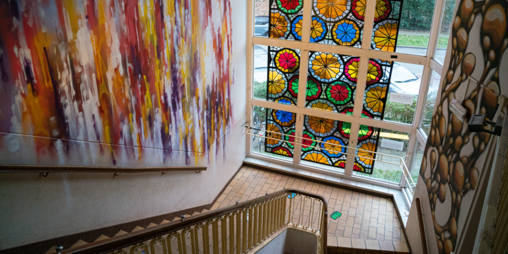
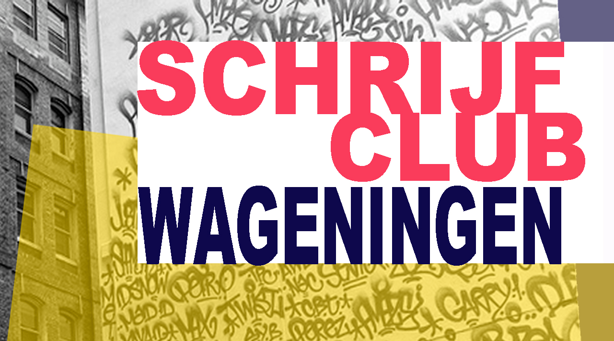

# Testplan website Cultuurwerkplaats Wageningen

## Introductie

Voor deze opdracht ga ik me richten op de website van de [**Cultuurwerkplaats**](https://decultuurwerkplaats.nl/) in Wageningen. Dit is een recent initiatief van de cultuurontwikkelaars van de Bibliotheek in Wageningen, de bbltkh. Er was er langere tijd behoefte aan meer plek voor cultuur in Wageningen, met de terugkerende vraag "is er ergens ruimte om iets te doen?" Daarvoor biedt de Cultuurwerkplaats uitkomst, hier kunnen mensen onder andere ruimtes boeken voor culturele activiteiten en culturele activiteiten bijwonen. Het is gevestigd in een oud schoolpand aan de Arboretumlaan in Wageningen.

 Mijn link met de Cultuurwerkplaats is dat ik twee keer per maand met veel plezier een schrijfgroep bezoek. Deze groep, [*Schrijfclub Wageningen*](https://www.edestad.nl/lokaal/overig/849934/kennismaken-met-schrijfclub-wageningen), wordt sinds kort in de Cultuurwerkplaats gehouden. Hier komen we eens in de twee weken bij elkaar om uitleg te krijgen over verhalen schrijven, thee te drinken, bezig te gaan met onze eigen projecten te luisteren naar het werk van mijn mede schrijvers.
 Ik ben de organisatie heel dankbaar dat ik mijn hobby uit kan blijven oefenen.

 

## Overzicht van de website

De Cultuurwerkplaats heeft een uitgebreide website met verschillende pagina's en achtergrond informatie. 

Als je de website bezoekt, zie je  op de voorpagina zie je als eerste drie kopjes in het midden: "Lid worden", "Huur ruimte", en "Cultuurloket". Bij het Cultuurloket kun je binnenlopen om een vraag te stellen, vooraf kun je een formulier op de site invullen met een vraag. De "lid worden" optie brengt je naar een aanmeldpagina om, inderdaad, lid te worden. Bij 'Huur Ruimte' kun je een ruimte huren om onder andere aan je kunst te werken of culture activiteiten te organiseren.

Verder naar beneden vind je; een agenda met datum, activiteit en plaats, zodat bezoekers kunnen zien aan welke activiteiten (zoals schrijftafel of open atelier) ze mee willen doen, een uitgelicht evenement met een grotere afbeelding en een knop "Kijk verder", een knop voor een online rondleiding en het adres en de contactgegevens van de Cultuurwerkplaats.

Zowel lid worden als zaal huren brengen geld binnen voor de organisatie. Ook zorgt het dat mensen gebruik kunnen maken van de ruimtes in de Cultuurwerkplaats om culturele activiteiten te houden.

De scope van mijn test ga ik beperken tot de hoofdpagina, dit is de pagina die alle bezoekers gelijk zien wanneer ze naar de site navigeren, het lid-worden formulier, en de "ruimte huren" interface. Als lid kun je dagelijks aan je eigen kunst werken in het gebouw en geef je geld aan de werkplaats, wanneer je een ruimte huurt zorgt dit ook voor inkomsten voor de werkplaats en het zorgt dat Wageningers een plek hebben om cultuur te beoefenen.

## Overzicht scope, wat ga ik testen?

De scope van mijn test ga ik beperken tot de [**hoofdpagina**](https://decultuurwerkplaats.nl/), het [**lid-worden**](https://decultuurwerkplaats.nl/open-atelier/lid-worden/) formulier, en de [**ruimte huren**](https://decultuurwerkplaats.nl/boekeenruimte/) interface. Deze drie pagina's vormen een belangrijke kern van de website. De hoofdpagina spreekt voor zich, het lid-worden formulier zorgt dat mensen zich in kunnen schrijven en een bijdrage geven aan de organisatie, de zaal huren interface maakt dat mensen een ruimte kunnen huren, een van de kerntaken van de Cultuurwerkplaats, dit zorgt ook voor meer activiteiten en inkomsten voor de werkplaats voor onderhoud. Wanneer ik het over 'website' heb, dan heb ik het over deze drie pagina's. Ik test de website alleen als bezoeker, op Windows 11.

Als testscenario's ga ik testen;

- Hoe is de algemene **gebruiksvriendelijkheid** (usability) van de website?

- Hoe is de **toegankelijkheid** (accesibility) van de website?

- Wat is de **laadsnelheid** van de website? (performance)

- Hoe is de **veiligheid** van de website? (security)

- Browsers Chrome, Firefox, Edge

### Gebruiksvriendelijkheid

De gebruiksvriendelijkheid test ik kwalitatief door de website handmatig te observeren en te beoordelen. Het begrip van gebruiksvriendelijk houd ik met opzet enigsins vaag, omdat er een breed scala aan dingen onder kunnen vallen die op kunnen vallen bij handmatig testen. Bijvoorbeeld een knop die wegvalt of een vreemde indeling. Hiermee begin ik, omdat het een grote impact heeft op hoe je de site navigeert. Een goede usability kan bezoekers aantrekken terwijl een slechte usability bezoekers kan afstoten.

### Toegankelijkheid

De toegankelijkheid van de website wordt handmatig en automatisch (Playwright) getest aan de hand van de [WCAG richtlijnen](https://www.w3.org/WAI/WCAG22/quickref/?showtechniques=121%2C131%2C133%2C311%2C321#principle1). Dit is de internationale standaard voor digitale toegankelijkheid. Toegankelijkheid is een belangrijke basis, zeker voor een website die mensen toegang geeft tot culturele activiteiten. Dit zou voor zoveel mogelijk mensen beschikbaar moeten zijn, ongeacht eventuele beperkingen.

[Op 28 juni 2025](https://www.digitaleoverheid.nl/nieuws/nieuwe-europese-toegankelijkheidswet/) is de Europese Toegankelijkheidswet ([European Accessibility Act, EAA](https://commission.europa.eu/strategy-and-policy/policies/justice-and-fundamental-rights/disability/european-accessibility-act-eaa_en) ) van kracht gegaan. Hierin is aangegeven dat digitale producten minimaal moeten voldoen aan de [WCAG 2.1](https://www.w3.org/Translations/WCAG21-nl/) richtlijnen, niveau A. Niveau A is het laagste toegankelijkheidsniveau, dit gaat tot maximaal AAAA. Wettelijk verplicht is alleen niveau A.

Er zijn meerdere [uitzonderingen op de EAA wet](https://eur-lex.europa.eu/legal-content/EN/TXT/?uri=CELEX%3A32019L0882), zo hoeven alleen overheden en bedrijven zich aan deze wet te houden, en alleen bedrijven of commerciële praktijken van een bepaalde grootte. Of de Cultuurwerkplaats wettelijk verplicht is zich aan deze eisen te houden is niet zeker. Wel is toetsen aan de toegankelijkheidseisen een mooie kans om in kaart te brengen hoe de webiste, en dus cultuur in Wageningen, nog toegankelijker gemaakt kan worden voor de inwoners van Wageningen. Ook kan het zijn dat (delen van) de website zich nu of in de toekomst wel degelijk aan deze wet moeten voldoen. Bijvoorbeeld het deel van de website dat ruimtes verhuurt, omdat dit gezien kan worden als commerciële activiteit. 

Alle toegankelijkheids testcases opgenomen in het testverslag zijn van niveau A, gekeken naar welke het meest relevant zijn voor de website. Zie ook de Appendix voor de volledige, officiële richtlijnen waarop de testcases gebaseerd zijn. De testcases in dit rapport zijn een interpretatie van de officiële wetgeving, dit rapport is geen vervanging van een officiële toetsing op toegankelijkheid.

### Veiligheid

De veiligheid test ik handmatig door te controleren op **HTTPS-gebruik**. Veiligheid is een van de belangrijkste eisen van elke website.

### Laadsnelheid

De performance meet ik door de **Largest Contentful Paint (LCP)** waarde te meten tegen de Google-standaard, vanaf mijn lokale verbinding (circa 100Mb/s). Performance is een cruciale niet-functionele eis omdat een slechte performance bezoekers wegjaagt van de website.

### Browsers

Browsers naar [marktaandeel](https://gs.statcounter.com/browser-market-share/desktop/netherlands). Worden getest bij de algemene gebruiksvriendelijk, of de lay-out overeenkomstig is.

| Browser | Marktaandeel |
|---------|--------------|
| Chrome  | 66.72%       |
| Edge    | 13.86%       |
| Firefox | 5.71%        |

## Wat ga ik niet testen?

- De content van de website naast de drie genoemde pagina's.
>Gezien de omvang van dit project en de tijd die ik heb ga ik de testen focussen op de pagina's die kernfunctionaliteiten van de website uitvoeren. 

- De **login** functie en daartoe behorende gebruikersrollen (lid, admin).
>Ik heb simpelweg geen toegang tot de gegevens om dit te testen.

 - **Het daadwerkelijk versturen van verzoeken** om lid te worden of een kamer te huren.
 >Hierbij zou ik mogelijk kosten kunnen maken bij de Cultuurwerkplaats. Zeker voor uitgebreide en repeterede tests is dit geen optie.

- Besturingssystemen: Linux en Mac OS.
> Hier heb ik geen toegang toe.

- Tablet en mobiel weergave.
> Voor de overzichtelijkheid van het testplan beperk ik de scope tot een computer omgeving.

## Prioriteitsindeling van de test scenario's met MOSCOW

### Must have 

- Performance van de website (laadsnelheid)

- Standaard veiligheidseis (HTTPS-verbinding)

### Should have 

- Toegankelijkheid van de website (WCAG-richtlijnen)

- Gebruiksvriendelijkheid van de hoofdpagina, het "lid worden" formulier en de "ruimte huren" interface

### Could have 

- Testen op andere besturingssystemen (Linux, Mac OS)

- Tablet- of mobielweergave

- Testen op verschillende browsers

### Won't have

- "Log in"-functionaliteit 

- Admin-rol 

- Blog (geen kernfunctionaliteit)

- Activiteiten-preview (geen kernfunctionaliteit)

- Daadwerkelijk versturen van verzoeken 

## Test scenario's en cases

 Alle tests richten zich op de [**hoofdpagina**](https://decultuurwerkplaats.nl/), het [**lid-worden**](https://decultuurwerkplaats.nl/open-atelier/lid-worden/) formulier, en de [**ruimte huren**](https://decultuurwerkplaats.nl/boekeenruimte/) interface.

### Test scenario - gebruikvriendelijkheid
Handmatig en kwalitatief testen, bevindingen rapporteren

Zijn er duidelijke incongruenties op de websites of dingen die opvallen?

Hoe is de algemene eerste indruk van de website?

### Test scenario - toegankelijkheid

De toegankelijkheidstest zijn gebaseerd op de WCAG 2.1 richtlijnen, niveau A. Zie ook Appendix A voor de originele testen. (schrappen?)

### Test cases
- **TC - 1** Alle niet-tekst content heeft een tekst alternatief dat het doel beschrijft.

- **TC - 1a** Indien dit niet het geval is, kijk in de appendix of het onder de uitzonderingen valt (appendix).

- **TC - 2**  Instructies bedoeld voor het begrijpen en uitvoeren van content maken niet alleen gebruik van vorm, kleur, grootte, plaatsing, oriëntatie of geluid.

- **TC - 3** Kleur is niet het enige middel dat gebruikt wordt om informatie over te brengen, een actie weer te geven, een respons te prompten of een visueel element te onderscheiden.

- **TC - 4** Alle functionele content van de pagina zijn bereikbaar met de tab toets.

- **TC - 4a** Het is duidelijk op welk deel van de pagina de content de focus is wanneer je met de tab navigeert.

- **TC - 5** Web pagina's hebben titels die de inhoud of het doel beschrijven.

- **TC - 6** De taal op de website kan uit de code achterhaald worden, zodat de schermlezer dit op kan pikken.

### Test scenario - performance

- **TC - 7** Hoe snel laadt de LCP van de hoofdpagina?

### Test scenario - veiligheid 

- **TC - 8** Maakt de website gebruik van HTTPS connectie?

## Planning

| Fase | Activiteit | Tijdsduur |
| :--- | :--- | :--- |
| **1** | **Testplan opstellen** | 2 week |
| **2** | **Testen – Gebruiksvriendelijkheid**| 1 week |
| **2** | **Testen – Toegankelijkheid** | 2 weken |
| **2** | **Testen - Performance**, **veiligheid** | 1 week |
| **2** | **Testrapport afronden** | 1 week |
| **3** | **Verbetervoorstellen opstellen** | 2 weken |
| | *Totaal (incl. overlap/buffer)* | *± 2 maanden* |

## Risico's

| Risico                                                             | Oplossing                                                                                                                                                |
| ------------------------------------------------------------------ | -------------------------------------------------------------------------------------------------------------------------------------------------------- |
| Website is tijdelijk niet bereikbaar.                              | Test uitstellen tot de site weer online is. Neem contact op met de beheerder als de storing lang duurt.                                                 |
| Formulieren versturen echt (bijv. betaling).                       | Test stopt voor de definitieve verzending; ik gebruik geen echte betaalgegevens en annuleer voor de laatste stap.                                       |
| Agenda bevat geen items (toevallig leeg).                          | Dit kan ik niet testen; in rapport vermelden dat agenda niet gevuld was op moment van testen.                                                           |
| Geen toegang tot bepaalde browsers (Safari).                       | Test alleen in beschikbare browsers en noteer beperking.                                                                                                 |
| Playwright-scripts falen door wijzigingen in de website.           | Scripts onderhouden tijdens het testen; bij grote wijzigingen de verwachtingen bijstellen en opnieuw testen.                                            |
| Beperkte tijd door onverwachte bevindingen.                        | Prioriteiten stellen: eerst de kernfunctionaliteiten (lid worden, zaal huren, agenda) testen, daarna de niet-functionele aspecten.                      |

