# Testrapport


## Gebruiksvriendelijkheid algemeen, eerste indruk

Bij het opstarten van de website is rechtsboven gelijk een duidelijk menu zichtbaar met de verschillende opties. Verder naar beneden is een agenda te zien met activiteiten waar je op kan klikken. Ook dit voelt intuïtief aan en het lettertype is groot en duidelijk. Alleen is de bovenste activiteit inclusief datum niet helemaal zichtbaar. De exacte datum is niet zichtbaar (zie afbeelding).

<a href="afbeeldingen/ref_gebr_det.png" target="_blank">
    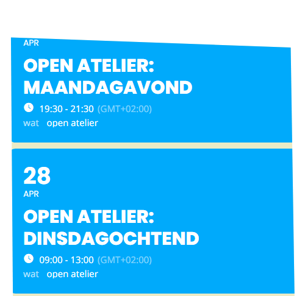
</a>


Verder naar het "lid worden" formulier. De link hiernaartoe is duidelijk zichtbaar op de pagina. Ook via het navigatie menu kun je naar deze pagina toegaan onder "Open Atelier". Iets beter was het geweest om nog een directe link in het navigatiemenu te zetten.

De pagina zelf lijkt goed te werken, alle invulvelden werken naar behoren en er zijn geen onduidelijkheden. De pagina is wel wat langzaam met laden.

Verder naar de 'boek een ruimte' pagina. Ook hier is makkelijk naartoe te navigeren vanaf het hoofdmenu en er wordt goede achtergrond informatie gegeven en regels. Verder voelt de navigatie door de 'ruimte huren' intuïtief aan. De lay-outs in Chrome, Firefox en Edge zijn vergelijkbaar. 

Wel valt op dat sommige instructies in het Engels zijn, hoewel de website grotendeels Nederlands is.
<br><br>


## Test scenario toegankelijkheid


> 1 Alle niet-tekst content heeft een tekst alternatief dat het doel beschrijft.

> 1a Indien dit niet het geval is, dan valt het onder de uitzonderingen (zie Appendix)


| Testcase              | Status      | Opmerking |Screenshot preview<br><span style="font-size:0.8em;">klik voor volledig screenshot</span>  |
|:----------------------|:------------|:----------|:-----------------------------------------------------|
| 1.1 hoofdpagina       | <span style="color:#E00000">fail</span> | de snelkoppeling naar het hoofdmenu heeft geen tekst alternatief | <a href="afbeeldingen/ref_1.1_huisje.png" target="_blank">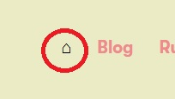</a>   |
| 1.1a uitzondering     | <span style="color:#E00000">fail</span> | de case valt niet onder de uitzonderingen | |
| 1.2 lid worden        | <span style="color:#E00000">fail</span> | de invoervelden zelf bevatten geen tekst | <a href="afbeeldingen/ref_2.2_pijl.png" target="_blank">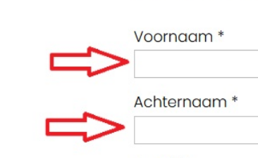</a> |
| 1.2a uitzondering     | <span style="color:#27F542">pass</span> | het label boven het invoerelement is gekoppeld, dus wanneer je op 'voornaam' klikt, kom je automatisch in het invoerveld terecht. | |
| 1.3 ruimte huren      | <span style="color:#E00000">fail</span> | het 'bewerken' symbool en de vlag bij het selecteren van de landcode hebben beide geen tekst alternatief | <a href="afbeeldingen/ref_1.3.1_potl.png" target="_blank">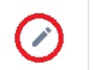</a>  <a href="afbeeldingen/ref_1.3.2_vlag.png" target="_blank">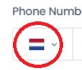</a> |
| 1.3a uitzondering     | <span style="color:#E00000">fail</span> | Het element bevat geen duidelijke titel of aria-label die door text-to-speech software opgevangen zou kunnen worden | |
<br><br>


> 2 Instructies bedoeld voor het begrijpen en uitvoeren van content maken niet alleen gebruik van vorm, kleur, grootte, plaatsing, orientatie of geluid

| Testcase              | Status      | Opmerking |Screenshot preview<br><span style="font-size:0.8em;">klik voor volledig screenshot</span>  |
|:----------------------|:------------|:----------|:-----------------------------------------------------|
|2.1 hoofdpagina        |<span style="color:#27F542">pass</span>         |voldoet    |                   |
|2.2 lid worden         |<span style="color:#E00000">fail</span>          | Hoewel er boven het formulier een beschrijving staat dat het ingevuld dient te worden, bevatten de invul-elementen zelf deze beschrijving niet. Ze maken dus enkel gebruik van 'plaatsing' voor context.   |      <a href="afbeeldingen/ref_2.2_pijl.png" target="_blank"></a>               |
|2.3 ruimte huren       |<span style="color:#27F542">pass</span>         | In de invoervelden wordt expliciet aangegeven wat voor invoer er verwacht wordt     | <a href="afbeeldingen/ref_2.3.1_tijd.png" target="_blank">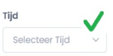</a> <a href="afbeeldingen/ref_1.3.2_vlag.png" target="_blank">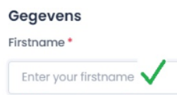</a>                   |
<br><br>


> 3 Kleur is niet het enige middel dat gebruikt wordt om informatie over te brengen, een actie weer te geven, een respons te prompten of een visueel element te onderscheiden

| Testcase              | Status      | Opmerking |Screenshot preview<br><span style="font-size:0.8em;">klik voor volledig screenshot</span>  |
|:----------------------|:------------|:----------|:-----------------------------------------------------|
|3.1 hoofdpagina        |<span style="color:#27F542">pass</span>         |voldoet    |                   |
|3.2 lid worden         |<span style="color:#27F542">pass</span>         |voldoet    |                   |
|3.3 ruimte huren       |<span style="color:#E00000">fail</span>           |In de agenda worden de dagen onderscheiden door enkel verschil in kleur. |<a href="afbeeldingen/ref_2.3.1_tijd.png" target="_blank">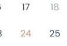</a> |
<br><br>


> 4  Alle functionele content van de pagina zijn bereikbaar met het de tab toets.

> 4a Het is duidelijk op welk deel van de pagina content de focus is wanneer je met de tab navigeert.

| Testcase              | Status      | Opmerking | Playwright test|
|:----------------------|:------------|:----------|:------------------|
|4.1 hoofdpagina        |<span style="color:#27F542">pass</span>        |voldoet |     [zie Playwright test](Cultuurwerkpl_Playwright/tests/TC-4.1-hoofdp_tab.spec.ts)    |
|4.1a focus duidelijk   |<span style="color:#E0B700">partial</span>     |Bij alle menu-elementen van de website is het duidelijk welk deel in focus is door een blauwe rand om het object. Bij de overige content is dit niet duidelijk.            |                   |
|4.2 lid worden         |<span style="color:#27F542">pass</span>         |voldoet   |  [zie Playwright test](Cultuurwerkpl_Playwright/tests/TC-4.2-lid_worden_tab.spec.ts)                 |
|4.2a focus duidelijk |<span style="color:#E0B700">partial</span> |Alleen bij de "versturen" knop is het niet duidelijk wanneer de focus zich hier bevindt     |           |                   |
|4.3 ruimte huren       |<span style="color:#E00000">fail</span>     |Het is niet mogelijk naar alle onderdelen van de pagina te navigeren alleen gebruikmakend van de "tab" toets           |[zie Playwright test](Cultuurwerkpl_Playwright/tests/TC-4.3-ruimte_huren_tab.spec.ts)                    | 
|4.3a focus duidelijk   |             |Niet van toepassing           |                   |
<br><br>


> 5 Web pagina's hebben titels die de inhoud of het doel beschrijven.

| Testcase              | Status      | Opmerking |Screenshot preview<br><span style="font-size:0.8em;">klik voor volledig screenshot</span>  |
|:----------------------|:------------|:----------|:-----------------------------------------------------|
|5.1 hoofdpagina        |<span style="color:#27F542">pass</span>             |voldoet |          <a href="afbeeldingen/ref_5.1_hoofd.png" target="_blank">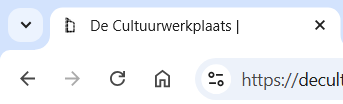</a>                  |
|5.2 lid worden         |<span style="color:#27F542">pass</span>             |voldoet           | <a href="afbeeldingen/ref_5.2_lid.png" target="_blank">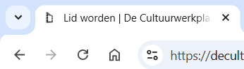</a>                |
|5.3 ruimte huren         |<span style="color:#27F542">pass</span>             |voldoet           | <a href="afbeeldingen/ref_5.3_zaal.png" target="_blank">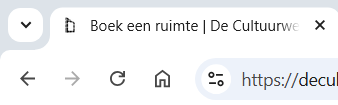</a>                    |
<br><br>

> 6  De taal op de website kan uit de code achterhaald worden, zodat de schermlezer dit op kan pikken.

| Testcase              | Status      | Opmerking | Screenshot preview|
|:----------------------|:------------|:----------|:------------------|
|6.1 hoofdpagina        | <span style="color:#27F542">pass</span>             |   ```` <html lang="nl-NL" class="js"><head> ````            |                 |
|6.2 lid worden         |<span style="color:#27F542">pass</span>             | ```` <html lang="nl-NL" class="js"><head> ````           |                  |
|6.3 ruimte  huren       |<span style="color:#27F542">pass</span>             |  ```` <html lang="nl-NL" class="js"><head> ````         |                  |
<br><br>

### Test scenario 7, snelheidstest

> 

Volgens de [richtlijn](https://web.dev/articles/lcp) is een goede LCP laadsnelheid 2.5 seconden of minder. 


| Testcase              | Status      | Opmerking |Screenshot preview<br><span style="font-size:0.8em;">klik voor volledig screenshot</span>  |
|:----------------------|:------------|:----------|:-----------------------------------------------------|
|7.1 hoofdpagina        |<span style="color:#E00000">fail</span>              | meer dan 2.5 sec          | <a href="afbeeldingen/ref_7_snel.png" target="_blank">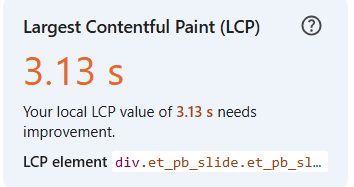</a>                    |
|7.2 lid worden         |<span style="color:#E00000">fail</span>             | meer dan 2.5 sec          |<a href="afbeeldingen/ref_7.2_snel.png" target="_blank">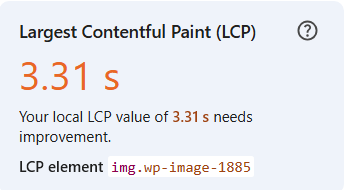</a>                  |
|7.3 ruimte  huren       |<span style="color:#E00000">fail</span>           |meer dan 2.5 sec           |<a href="afbeeldingen/ref_7.3_snel.png" target="_blank">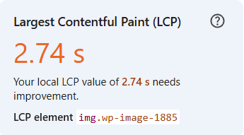</a>                  |

### Test scenario 8, veiligheid

Maakt de website gebruik van HTTPS-encryptie?


| Testcase              | Status      | Opmerking |Screenshot preview<br><span style="font-size:0.8em;">klik voor volledig screenshot</span>  |
|:----------------------|:------------|:----------|:-----------------------------------------------------|
|8.1| <span style="color:#27F542">pass</span> | | <a href="afbeeldingen/ref_8_veil.png" target="_blank">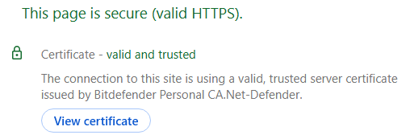</a>  |


